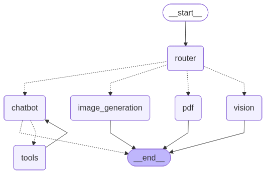
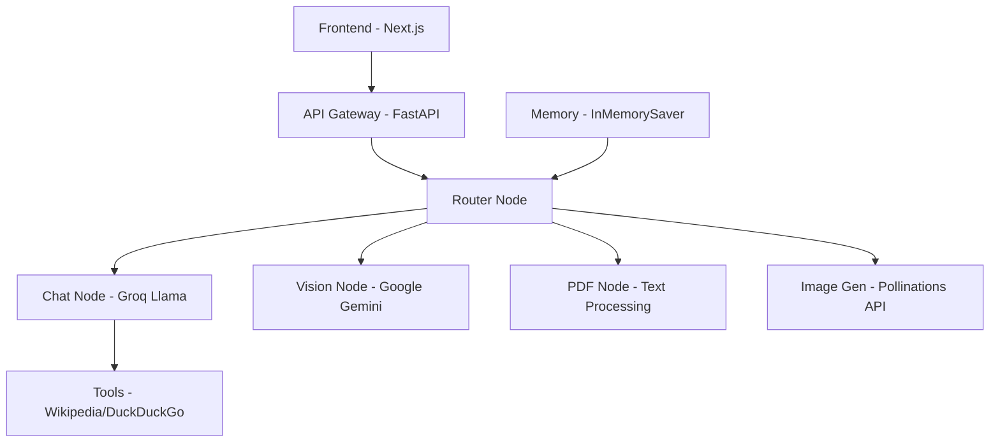

# AI Assistant Chat Bot 🤖

A full-stack AI-powered chat application that supports text conversations, image analysis, PDF processing, and AI image generation. Built with **FastAPI** (backend) and **Next.js** (frontend) using modern web technologies.

   

## 🏗️ Architecture



## ✨ Features

### 🗨️ **Multi-Modal Chat Experience**
- **Text Chat**: Natural conversations with Bob, your AI assistant
- **Image Analysis**: Upload images and ask questions about them
- **PDF Processing**: Upload PDFs for summarization and Q&A
- **Image Generation**: Create images from text descriptions using AI

### 🧠 **Smart Routing System**
- Intelligent request routing to appropriate AI models
- Context-aware responses with conversation memory
- Real-time message processing with loading states

### 🎨 **Modern UI/UX**
- Clean, responsive design built with Tailwind CSS
- Dark/light theme support with shadcn/ui components
- Conversation history with persistent storage
- Drag-and-drop file uploads
- Real-time typing indicators

### 🔧 **Technical Features**
- RESTful API with FastAPI
- Type-safe TypeScript frontend
- State management with React hooks
- File upload support (images & PDFs)
- Cross-origin resource sharing (CORS) enabled
- Error handling and loading states

## 🏗️ Architecture



## 🚀 Quick Start

### Prerequisites

- **Python 3.8+**
- **Node.js 18+**
- **npm/pnpm/yarn**

### 🔑 Environment Setup

1. **Clone the repository:**
```bash
git clone <repository-url>
cd bot
```

2. **Backend Environment:**
```bash
cd backend
cp .env.example .env
```

3. **Add your API keys to `.env`:**
```env
GOOGLE_API_KEY=your_google_api_key_here
GROQ_API_KEY=your_groq_api_key_here
```

### 🎯 Installation & Running

#### Backend Setup
```bash
cd backend

# Install dependencies
pip install -r requirements.txt

# Start the FastAPI server
uvicorn main:app --reload --host 0.0.0.0 --port 8000
```

#### Frontend Setup
```bash
cd frontend

# Install dependencies
npm install
# or
pnpm install

# Start the development server
npm run dev
# or
pnpm dev
```

### 🌐 Access the Application

- **Frontend**: http://localhost:3000
- **Backend API**: http://localhost:8000
- **API Documentation**: http://localhost:8000/docs

## 🛠️ API Endpoints

### Chat Endpoints

| Endpoint | Method | Description | Request Body |
|----------|--------|-------------|--------------|
| `/chat` | POST | Text-based conversations | `{"message": "string", "thread_id": "string"}` |
| `/vision` | POST | Image analysis with questions | `{"question": "string", "image_url": "string", "thread_id": "string"}` |
| `/pdf` | POST | PDF processing and Q&A | Form data with file and query |
| `/generate-image` | POST | AI image generation | `{"prompt": "string", "width": 1024, "height": 1024}` |
| `/health` | GET | Health check | None |

### Example API Usage

#### Text Chat
```bash
curl -X POST "http://localhost:8000/chat" \
  -H "Content-Type: application/json" \
  -d '{"message": "Hello, how are you?", "thread_id": "user123"}'
```

#### Image Analysis
```bash
curl -X POST "http://localhost:8000/vision" \
  -H "Content-Type: application/json" \
  -d '{"question": "What do you see?", "image_url": "data:image/png;base64,...", "thread_id": "user123"}'
```

#### PDF Processing
```bash
curl -X POST "http://localhost:8000/pdf" \
  -F "file=@document.pdf" \
  -F "query=Summarize this document" \
  -F "thread_id=user123"
```

## 🧩 Tech Stack

### Backend
- **Framework**: FastAPI
- **AI Models**: 
  - Groq Llama 3.3 70B (Text)
  - Google Gemini 2.5 Flash (Vision)
- **Tools**: LangChain, LangGraph
- **Memory**: InMemorySaver for conversation persistence
- **External APIs**: 
  - Wikipedia
  - DuckDuckGo Search
  - Pollinations (Image Generation)

### Frontend
- **Framework**: Next.js 14 with App Router
- **Language**: TypeScript
- **Styling**: Tailwind CSS
- **UI Components**: shadcn/ui + Radix UI
- **State Management**: React hooks
- **HTTP Client**: Fetch API

## 📁 Project Structure

```
bot/
├── backend/
│   ├── main.py              # FastAPI application & endpoints
│   ├── config.py            # Model and tool configurations
│   ├── models.py            # Pydantic request models
│   ├── graphs.py            # LangGraph workflow definitions
│   ├── requirements.txt     # Python dependencies
│   └── chatbot.ipynb        # Development notebook
├── frontend/
│   ├── app/
│   │   ├── page.tsx         # Main chat interface
│   │   ├── layout.tsx       # App layout and metadata
│   │   └── globals.css      # Global styles
│   ├── components/
│   │   ├── ui/              # shadcn/ui components
│   │   ├── chat-window.tsx  # Chat interface component
│   │   ├── chat-input.tsx   # Message input with file upload
│   │   ├── message.tsx      # Message display component
│   │   └── sidebar.tsx      # Conversation history sidebar
│   ├── lib/
│   │   ├── api.ts           # API utilities
│   │   └── utils.ts         # Helper functions
│   └── package.json         # Node.js dependencies
└── README.md               # This file
```

## 🎨 Key Features Deep Dive

### 1. **Smart Message Routing**
The application uses a sophisticated routing system that automatically determines the best AI model for each request:
- Text messages → Groq Llama for general conversation
- Images → Google Gemini Vision for image analysis
- PDFs → Text extraction + Groq Llama for document processing
- Image generation requests → Pollinations API

### 2. **Conversation Memory**
- Persistent conversation threads using LangGraph's InMemorySaver
- Each conversation maintains context across multiple interactions
- Frontend localStorage for conversation history

### 3. **File Upload Support**
- **Images**: Drag-and-drop or click to upload (PNG, JPG, GIF)
- **PDFs**: Direct file upload with text extraction
- Real-time file preview and validation

### 4. **Responsive Design**
- Mobile-first responsive design
- Modern chat interface with smooth animations
- Theme support with CSS custom properties

## 🔧 Configuration

### Backend Configuration (`config.py`)
```python
# AI Models
text_model = ChatGroq(model="llama-3.3-70b-versatile")
vision_model = ChatGoogleGenerativeAI(model="gemini-2.5-flash")

# Tools
tools = [DuckDuckGoSearchResults(), WikipediaQueryRun()]

# Memory
checkpointer = InMemorySaver()
```

### Frontend Configuration
- API base URL: `http://localhost:8000`
- File size limits: Configurable in components
- Theme: CSS custom properties in `globals.css`

## 🚨 Troubleshooting

### Common Issues

1. **API Key Errors**
   - Ensure `.env` file exists in backend directory
   - Verify API keys are valid and active

2. **CORS Issues**
   - Frontend URL must match CORS origins in `main.py`
   - Default: `http://localhost:3000`

3. **File Upload Failures**
   - Check file size limits
   - Ensure proper file types (images: png/jpg, documents: pdf)

4. **Model Errors**
   - Verify internet connectivity for external APIs
   - Check API key quotas and limits

### Backend Logs
```bash
# Enable detailed logging
uvicorn main:app --reload --log-level debug
```

### Frontend Development
```bash
# Check for TypeScript errors
npm run lint

# Build for production
npm run build
```

## 📈 Performance Optimization

### Backend
- Async/await for non-blocking operations
- Efficient file processing with streaming
- Connection pooling for external APIs

### Frontend
- React 18 concurrent features
- Image lazy loading
- Component code splitting

## 🤝 Contributing

1. Fork the repository
2. Create a feature branch (`git checkout -b feature/amazing-feature`)
3. Commit your changes (`git commit -m 'Add amazing feature'`)
4. Push to the branch (`git push origin feature/amazing-feature`)
5. Open a Pull Request

## 📄 License

This project is licensed under the MIT License - see the [LICENSE](LICENSE) file for details.

## 🙏 Acknowledgments

- **LangChain & LangGraph** for AI workflow orchestration
- **Groq** for fast language model inference
- **Google AI** for vision capabilities
- **Pollinations.ai** for image generation
- **shadcn/ui** for beautiful UI components
- **Vercel** for Next.js framework

## 📞 Support

For support, email [your-email] or create an issue in the repository.

---

**Made with ❤️ using FastAPI and Next.js**
